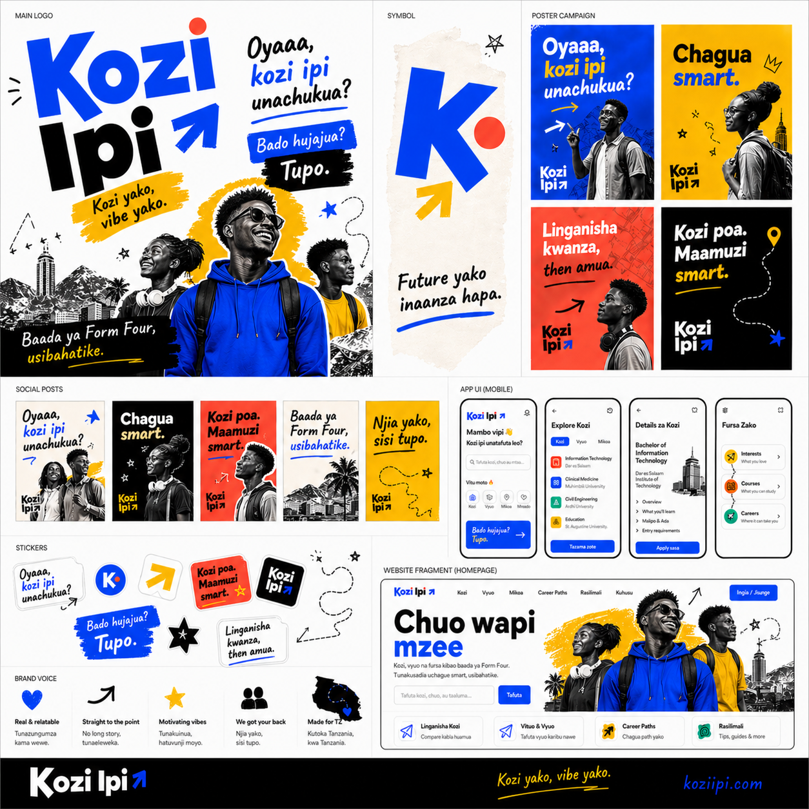

# Kozi Ipi

Kozi Ipi is a Tanzania education discovery platform for students planning their next study path after Form Four, A-level, or diploma. It helps students, parents, and guardians search institutions and programmes using course names, careers, locations, subjects, award levels, and eligibility constraints.

## Brand Direction



## Stack

- Next.js
- shadcn UI preset
- Convex
- Bun

## Local Setup

Install dependencies:

```sh
bun install
```

Build the processed dataset:

```sh
bun run data:build
```

Start Convex:

```sh
bun run convex:dev
```

Import processed data into Convex:

```sh
bun run data:import
```

Import processed data into production Convex:

```sh
bun run data:import:prod
```

Start Next.js:

```sh
bun run dev
```

## Data Flow

Raw datasets live in:

```text
data/raw/tanzania-post-form-four-dataset
data/raw/tanzania-education-dataset
```

The broader education dataset is the canonical base. The NACTVET-focused dataset enriches matching institutions and programmes.

Processed import files are generated in:

```text
data/processed
```

Admin moderation is protected with a private Convex `ADMIN_API_KEY`. Keep real admin keys and private admin notes in local ignored files only.

## Search Principle

```text
Lexical search finds.
Rules decide eligibility.
Semantic search suggests.
```

## License

Code is licensed under the MIT License. Data is provided with source notes and should be verified against official sources before use. Kozi Ipi brand assets are not licensed for reuse without permission.

See:

- [LICENSE](LICENSE)
- [DATA_LICENSE.md](DATA_LICENSE.md)
- [CONTRIBUTING.md](CONTRIBUTING.md)
